# README: Automated Multi-Genre Classification of Novels

## Overview
An NLP and machine learning project for classifying English-language novels into 10 genres using data from Project Gutenberg. Techniques include preprocessing (lemmatization, TF-IDF), feature selection, and machine learning models like Logistic Regression and RNNs.

## Dataset
- **Source:** Project Gutenberg
- **Genres:** Adventure, Comedy, Drama, Fantasy, Fiction, Horror, Mystery, Nonfiction, Romance, Science Fiction
- **Size:** 762 novels

## Methodology
1. **Preprocessing:** Text cleaning, tokenization, stop-word removal, TF-IDF vectorization.
2. **Models:** Logistic Regression, Random Forest, Naïve Bayes, RNNs.
3. **Evaluation Metrics:** F1 Score, Precision, Recall, Hamming Loss.

## Results
- Logistic Regression achieved the best baseline with F1-macro score: **0.5**.
- Visualizations: Genre heatmaps, word clouds, text length distributions.

## Acknowledgments
1. **[Book Genre Classification by A. Bhatia](https://github.com/akshaybhatia10/Book-Genre-Classification)**: Challenges of title-based classification.
2. **[Naïve Bayes and Maximum Entropy Comparison](chrome-extension://oemmndcbldboiebfnladdacbdfmadadm/https://iopscience.iop.org/article/10.1088/1742-6596/1722/1/012007/pdf)**: Insights into multi-label classification.

## Contributors
This project was completed by a group of four members. To acknowledge their contributions, please mention their names as follows:

1. **[Yahya](https://github.com/EllE961)**
2. **[Omar](https://github.com/alsadio)** 
3. **[Abdullah Al Salmi](https://github.com/abalsalmi)**
4. **[Abdullah Al Rashdi](https://github.com/Al-Rashdi)**

### Figures
1. **Genre Co-occurrence Heatmap**  
   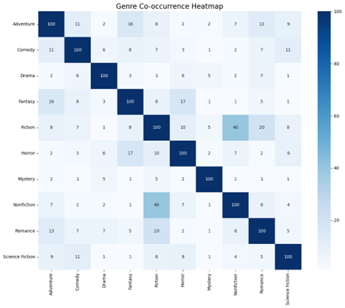

2. **Distribution of Text Lengths**  
   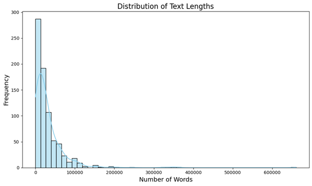

3. **Top 50 Words across all Genres**  
   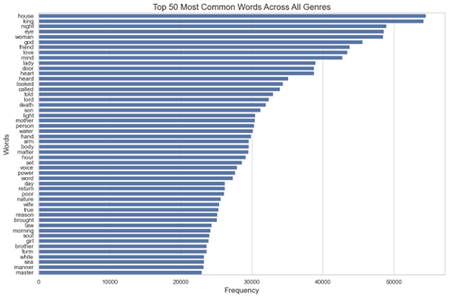

4. **Word Clouds by Genre**  
   - Adventure: 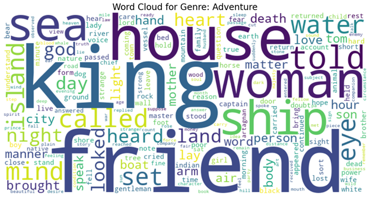
   - Comedy: 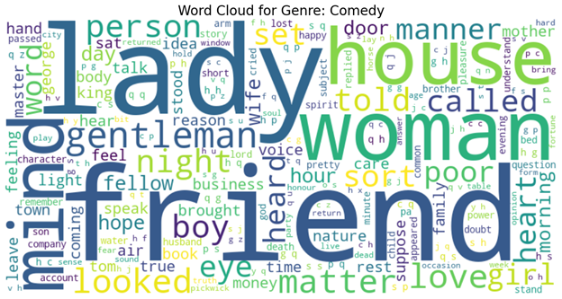
   - Drama: 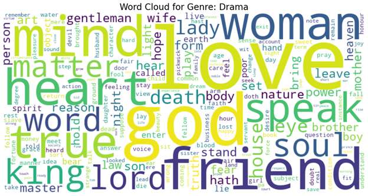
   - Fiction: 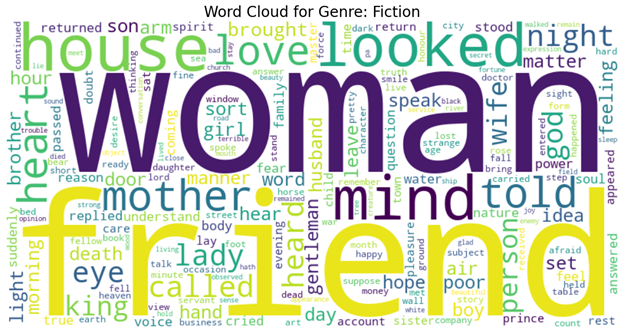
   - Fantasy: 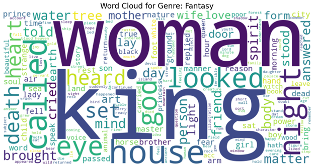
   - Horror: 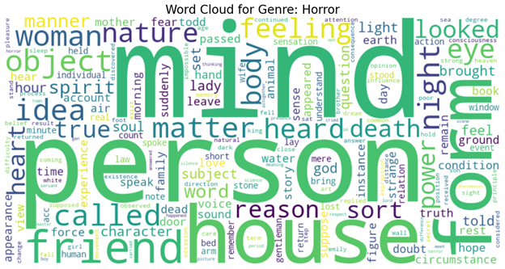
   - Mystery: 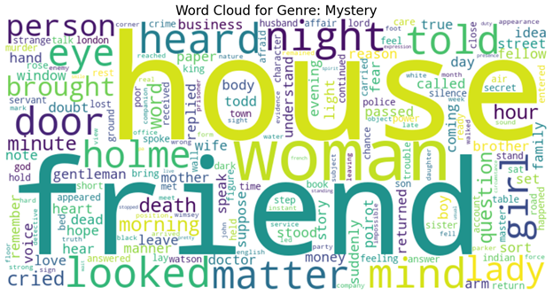
   - Nonfiction: 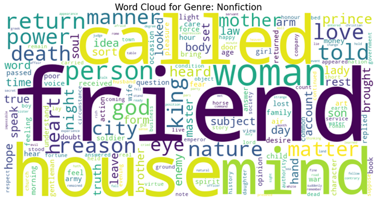
   - Romance: 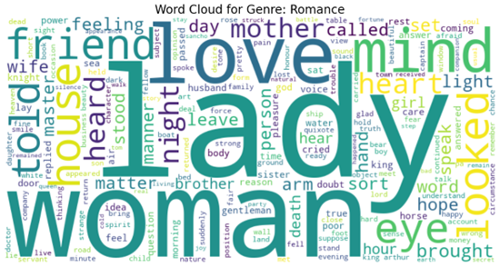
   - Science Fiction: 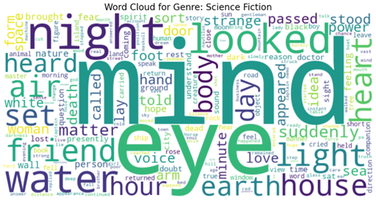
